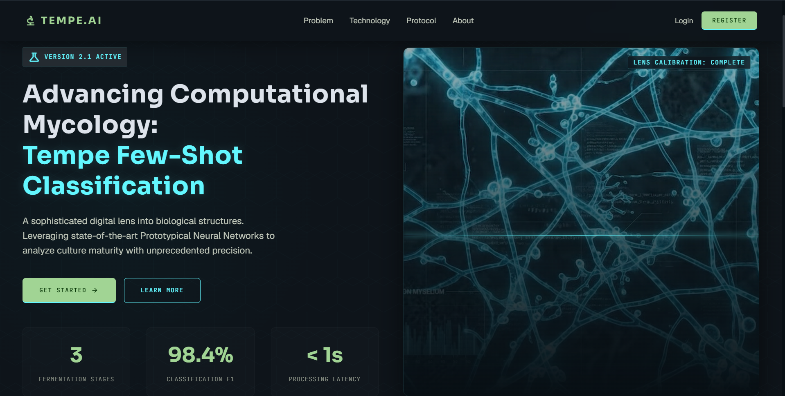
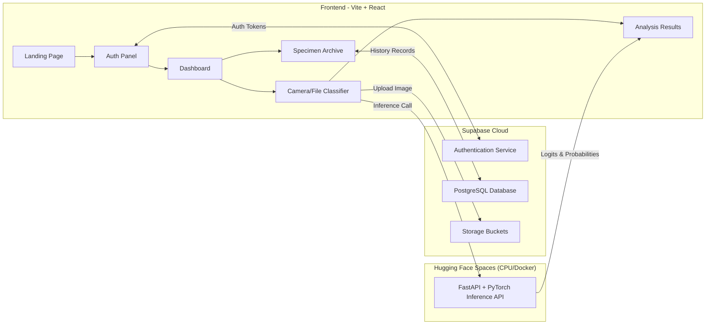

# 🧬 TempeClassify — Computational Mycology Platform 🌿


> **A web-based artificial intelligence platform designed to classify tempe (fermented soybean) fermentation stages.**
> _Built as a Computational Biology university final project!_ 🚀
>
> **🌟 Live Demo:** [**TempeClassify Web App**](https://tempeai.vercel.app/) | [**API Inference**](https://huggingface.co/spaces/yosukeyun/tempe)

## 📖 Project Overview

**TempeClassify** classifies tempe fermentation stages into **Day 0 (unfermented)**, **Day 1 (partially fermented)**, and **Day 2 (optimally mature)**.

The system leverages a **Prototypical Neural Network** with a **ResNet-50 backbone** trained using Few-Shot Learning (FSL) and Cosine Similarity. This approach ensures robust categorization with minimal training data.

## 🎥 Video Demonstration

[](https://drive.google.com/file/d/1OJk-9nkYJgF2oAzEMvA9K6Plb7Mw6X6M/view?usp=drive_link)

*(Click the image above to watch the full demonstration)*

## ✨ Key Features

- **🤖 AI Maturity Assessment**: Classify fermentation stages based on image analysis with high confidence.
- **🎨 Biotech-focused Dark Glassmorphism Design**: High-end clinical user interface built with Vite + React.
- **📸 Camera / File Upload Support**: Capture specimens directly using browser WebRTC cameras or drop raw images.
- **🔒 Secure Session Logging**: Authenticated research dashboard powered by Supabase with full history archiving.
- **🧠 Few-Shot Learning Protocol**: Robust categorization using only 10 support reference images per class, achieving **96.10% overall classification accuracy** on test datasets.

## 🤝 My Role & Contributions

Although this was a group project, I took full responsibility as the **Lead Full-Stack AI Developer**, independently designing and implementing the entire end-to-end architecture from the user interface to the machine learning inference engine. My specific contributions include:

- **Frontend Development:** Built the entire single-page client application using Vite + React, integrating WebRTC for live specimen capturing and implementing the Biotech-focused Dark Glassmorphism UI.
- **Backend & Model Deployment:** Developed the Python FastAPI server to serve the PyTorch model predictions and seamlessly deployed it to Hugging Face Spaces using the Docker SDK.
- **Few-Shot Learning Implementation:** Engineered the Cosine Similarity metric with Learned Temperature scaling ($T = 9.8559$) and optimized the 10-shot support set evaluation pipeline.
- **Database Architecture:** Configured Supabase Storage Buckets for image handling and PostgreSQL for secure session logging with Row-Level Security (RLS).

## 📐 System Architecture



## 📂 Project Repository Structure

- `frontend/` - Vite + React single-page client application.
- `api/` - Python FastAPI backend containing PyTorch model weights deployed to Hugging Face Spaces.
- `code/` - Few-Shot Training logic, sampler definitions, and the support set optimization pipeline.
- `supabase/` - Database schemas and Row-Level Security (RLS) migration scripts.

## ⚙️ Local Installation & Development

> **Note:** For security reasons, the `.env` file containing the production Supabase keys and API endpoints is not included in this repository. To run this locally, you must provide your own API keys or contact the author for a temporary testing environment.

### 1. Setup Backend API

Navigate to the `api` folder:

```bash
cd api
pip install -r requirements.txt
uvicorn app:app --reload --port 8000
```

### 2. Setup Frontend Client

Navigate to the `frontend` folder:

```bash
cd ../frontend
npm install
npm run dev
```

Create a `.env` file in the `frontend` root:

```env
VITE_SUPABASE_URL=YOUR_SUPABASE_URL
VITE_SUPABASE_ANON_KEY=YOUR_SUPABASE_ANON_KEY
VITE_HF_API_URL=http://localhost:8000 # or your Hugging Face Space URL
```

## 🌐 Deployment

### Frontend (Vercel)

The React frontend is hosted on **Vercel**.

- **Preset**: Vite
- **Root Directory**: `frontend`
- **Build Command**: `npm run build`
- **Output Directory**: `dist`
- Requires `VITE_SUPABASE_URL`, `VITE_SUPABASE_ANON_KEY`, and `VITE_HF_API_URL` to be set in Vercel's Dashboard Environment Variables.

### Database

Supabase acts as the cloud database and authentication provider.

### Backend (Hugging Face Spaces)

The FastAPI inference server is deployed to **Hugging Face Spaces** using the **Docker SDK** free CPU tier, utilizing the files in the `api/` directory.

## 📊 Evaluation Metrics

- **Feature Extractor**: ResNet-50
- **Distance Metric**: Cosine Similarity + Learned Temperature scaling ($T = 9.8559$)
- **Support Configuration**: 10-shot support set per class
- **Overall Test Accuracy**: **96.10%** (231 test query images)
  - _Day-0 Accuracy_: 96.55%
  - _Day-1 Accuracy_: 96.20%
  - _Day-2 Accuracy_: 95.38%

## 👨‍💻 Author

Yosuke Yung
CS Student @ BINUS UNIVERSITY
