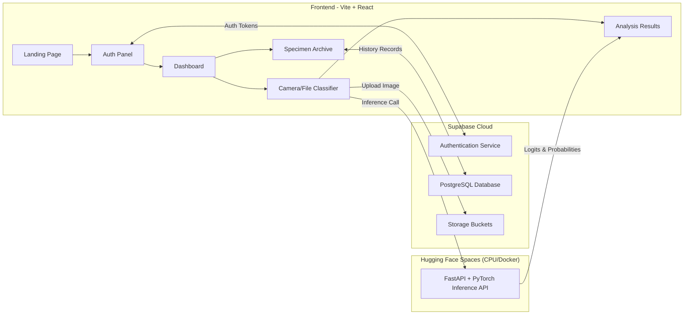

# TempeClassify 🧬 — Computational Mycology Platform

**TempeClassify** is a web-based artificial intelligence platform designed to classify tempe (fermented soybean) fermentation stages—**Day 0 (unfermented)**, **Day 1 (partially fermented)**, and **Day 2 (optimally mature)**. 

The system leverages a **Prototypical Neural Network** with a **ResNet-50 backbone** trained using Few-Shot Learning (FSL) and Cosine Similarity.

---

## 🚀 Key Features

* **AI Maturity Assessment**: Classify fermentation stages based on image analysis with high confidence.
* **Biotech-focused Dark Glassmorphism Design**: High-end clinical user interface built with Vite + React.
* **Camera / File Upload Support**: Capture specimens directly using browser WebRTC cameras or drop raw images.
* **Secure Session Logging**: Authenticated research dashboard powered by Supabase with full history archiving.
* **Few-Shot Learning Protocol**: Robust categorization using only 10 support reference images per class, achieving **96.10% overall classification accuracy** on test datasets.

---

## 📐 System Architecture



---

## 📂 Project Repository Structure

* `frontend/` - Vite + React single-page client application.
* `api/` - Python FastAPI backend containing PyTorch model weights deployed to Hugging Face Spaces.
* `v2/` - Few-Shot Training logic, sampler definitions, and the support set optimization pipeline.
* `supabase/` - Database schemas and Row-Level Security (RLS) migration scripts.

---

## ⚙️ Local Installation & Development

### 1. Setup Backend API
Navigate to the `api` folder:
```bash
cd api
pip install -r requirements.txt
uvicorn app:app --reload --port 8000
```

### 2. Setup Frontend Client
Navigate to the `frontend` folder:
```bash
cd ../frontend
npm install
npm run dev
```

Create a `.env` file in the `frontend` root:
```env
VITE_SUPABASE_URL=https://your-supabase-id.supabase.co
VITE_SUPABASE_ANON_KEY=your-supabase-anon-key
VITE_HF_API_URL=http://localhost:8000 # or your Hugging Face Space URL
```

---

## 🌐 Deployment

### Frontend (Vercel)
The React frontend is hosted on **Vercel**. 
* **Preset**: Vite
* **Root Directory**: `frontend`
* **Build Command**: `npm run build`
* **Output Directory**: `dist`
* Requires `VITE_SUPABASE_URL`, `VITE_SUPABASE_ANON_KEY`, and `VITE_HF_API_URL` to be set in Vercel's Dashboard Environment Variables.

### Backend (Hugging Face Spaces)
The FastAPI inference server is deployed to **Hugging Face Spaces** using the **Docker SDK** free CPU tier, utilizing the files in the `api/` directory.

---

## 📊 Evaluation Metrics
* **Feature Extractor**: ResNet-50
* **Distance Metric**: Cosine Similarity + Learned Temperature scaling ($T = 9.8559$)
* **Support Configuration**: 10-shot support set per class
* **Overall Test Accuracy**: **96.10%** (231 test query images)
  * *Day-0 Accuracy*: 96.55%
  * *Day-1 Accuracy*: 96.20%
  * *Day-2 Accuracy*: 95.38%

---

*Computational Biology Project — Created by [Yosuke](https://github.com/yosukeyung).*
